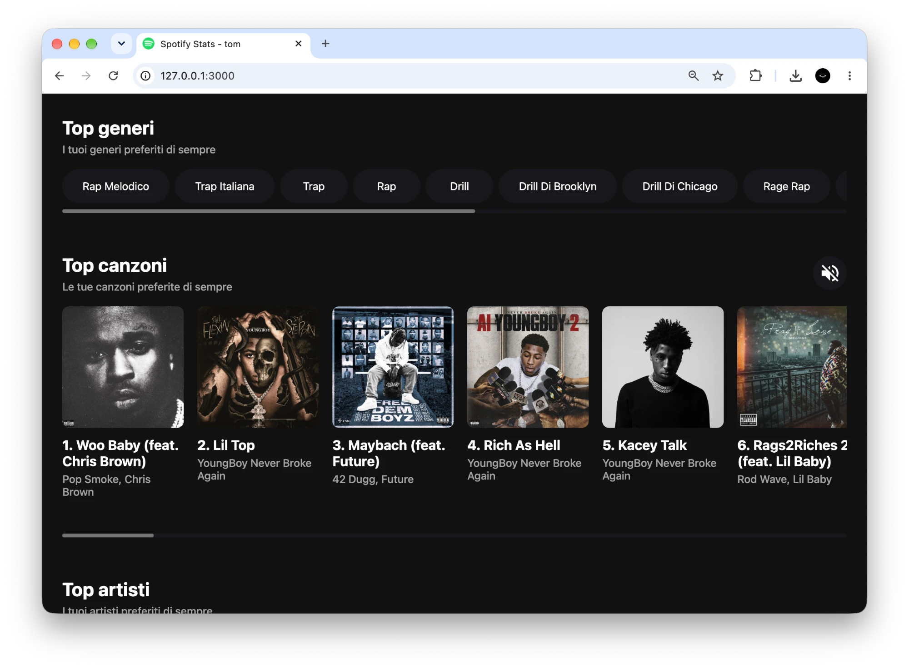
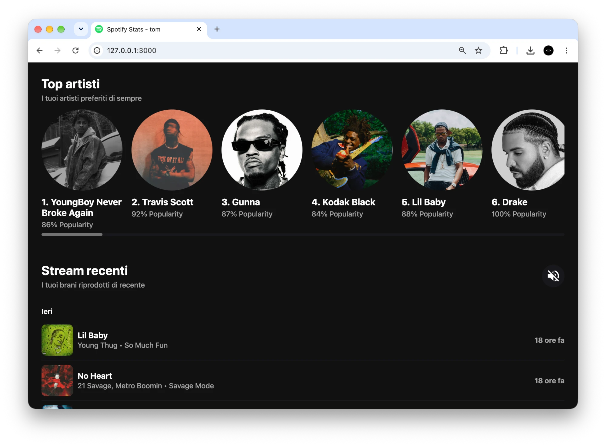
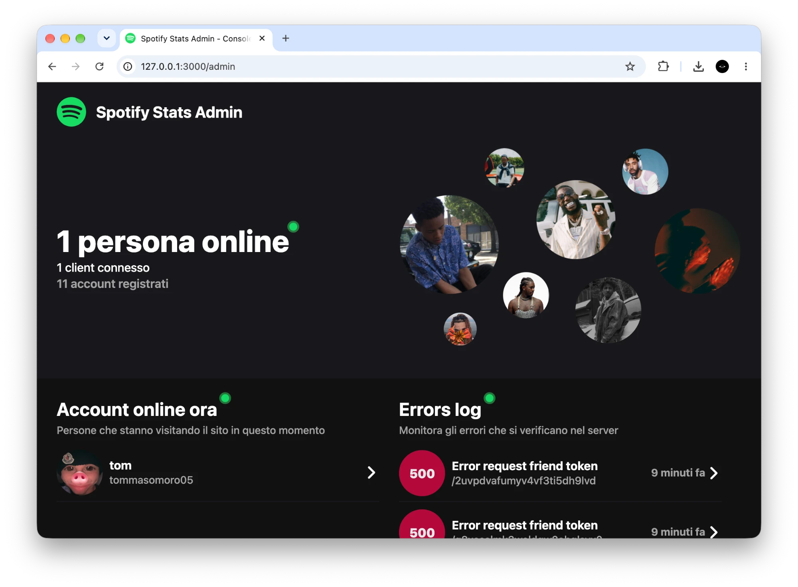
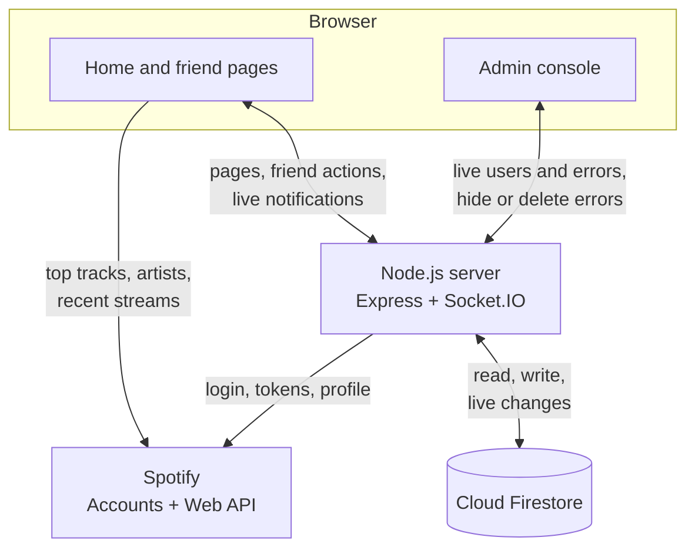

# Spotify Stats

A web app where my friends and I log in with Spotify to see our top genres, tracks and artists.

[](LICENSE)




**Live demo:** https://morotommaso.altervista.org/spotify-stats-demo-app/

To let anyone use the app, Spotify would have to approve it for use outside development mode. That approval has strict requirements that went well beyond the scope of this project. So I kept the API in development mode, with access for a few close friends, and for everyone else I made a static demo: it shows how the app looks, using a snapshot of my Spotify data from October 2026.

<!-- portfolio:summary
## The problem
Music is one of my passions, and I had seen sites that show your Spotify stats. I took the chance to build my own, with a social side, and learn how a third-party API with OAuth works.

## The solution
A Node.js web app: you log in with Spotify and see your top genres, tracks and artists over three time ranges, plus your recent streams. You can add friends by Spotify ID and open their stats. An admin console shows who is online and the server errors.

## Technical challenges
- Keeping sessions alive: the server swaps the refresh token for a new access token when the old one expires.
- Friends' stats: Spotify shows top items only to their owner, so the server stores each user's refresh token.
- Live updates: Firestore listeners push notifications, friends and errors to the browser through Socket.IO.

## What I learned
- How the OAuth 2.0 authorization code flow and refresh tokens work.
- How to manage sockets for live updates with Socket.IO.
- How to build an admin console with a live log of server errors.

## Stack
Node.js, Express, Socket.IO, Cloud Firestore, Spotify Web API, JavaScript, HTML, CSS
-->

<!-- portfolio:start -->
## The problem
Music is one of my passions. I had seen a few sites that show your top tracks and artists on Spotify, and I took the chance to learn new skills while having fun with it. I wanted my own version, for me and my friends, with a social side: seeing what the others listen to.

It was also a way to learn how a third-party API works beyond a single request: logging in with OAuth, keeping the session alive with refresh tokens, and calling the API both from the server and from the browser.

## The solution
You open the site and log in with your Spotify account. The home page shows your profile picture, name, email and number of friends, then four sections:

- **Top genres:** Spotify doesn't give genres for a user, so I count how many of your top 50 artists have each genre and sort them.
- **Top tracks:** your 50 most played tracks. If you turn on the speaker button, hovering a cover for one second plays the 30-second preview with a fade in and fade out (Spotify no longer returns previews, see the limitations).
- **Top artists:** your 50 most played artists, with their popularity score.
- **Recent streams:** the last 30 tracks you played, grouped by day, with the time since you played them.

A selector switches the first three sections between the last 4 weeks, the last 6 months and all time. Clicking a cover or a name opens it on Spotify. The interface is only in Italian.



Clicking your profile picture opens a side bar. It lists your friends and when they were last online, the invites you received, which you can accept or decline, and the invites you sent, which you can cancel. You add a friend by typing their Spotify ID. Every invite, answer or removal sends a notification to the other person, shown as a counter on the profile picture. Clicking a friend opens the same page with their stats.

One account, chosen with `ADMIN_SPOTIFY_ID` in `.env`, also has an admin console at `/admin`. It shows live how many people and devices are connected, how many accounts are registered, who went offline last, and the latest server errors. The admin can hide or delete an error and open the stats of any user.



## Technical challenges
- **Keeping the session alive.** I followed Spotify's [authorization code flow](https://developer.spotify.com/documentation/web-api/tutorials/code-flow). An access token lasts one hour, so I keep it in an `httpOnly` cookie with the same lifetime and keep the refresh token in a longer one. When a Spotify call fails, the server deletes the access token and redirects to `/refresh_token`, which asks Spotify for a new one and sends the user back to the page they asked for (`?then=`). In the browser, a `401` from Spotify triggers the same redirect.
- **Showing a friend's stats.** Spotify only shows top tracks and artists to their owner, through that user's token. So at every login I save the user's refresh token in Firestore. When you open a friend's page, the server checks that you are friends and trades the friend's refresh token for a fresh access token. This works, but it has a security cost (see the limitations).
- **Friend system on a document database.** Each user document in Firestore has four subcollections: `friends`, `friend-invited`, `friend-invited-by` and `notifications`. An invite writes in two places, one for each user. Accepting it adds the friendship on both sides and deletes the invite. Before writing, the server checks the existing documents to block self-invites, duplicate invites and invites to people who already invited you.
- **Live updates without polling.** When the page opens a Socket.IO connection, the server reads the access token from the cookie, checks it with Spotify and starts Firestore [`onSnapshot` listeners](https://firebase.google.com/docs/firestore/query-data/listen) on the user's subcollections. Every change goes to the browser right away, and the listeners stop when the socket disconnects. The admin console uses its own namespace. The server keeps an in-memory list of connected users and devices and sends every change to it.

## What I learned
- How the OAuth 2.0 authorization code flow works: `state`, authorization code, access token, refresh token and how long each one lasts.
- How to use a third-party API from both the server and the browser, reading the official Spotify and Firebase documentation.
- How to manage sockets: checking who opens each connection, starting the listeners for that user and stopping them when the socket disconnects.
- How to build an admin console: logging every server error to the database with status, path and user, and watching it live.

## Stack
- Node.js and Express
- Socket.IO for live updates
- Firebase Admin SDK with Cloud Firestore
- Spotify Web API
- `helmet`, `express-rate-limit`, `cookie-parser`, `dotenv`, `request-promise-native`
- HTML, CSS and JavaScript in the browser, without frameworks
<!-- portfolio:end -->

## Architecture


The browser asks Spotify for the stats directly. The server handles login and tokens, keeps users, friends and errors in Firestore, and pushes every change to the open pages through Socket.IO.

The important choices:

- **Pages are JavaScript functions that return HTML.** Each file in `views/` takes the data and returns a template string. There is no template engine and no build step: the server is started with `node`.
- **Spotify data is loaded by the browser.** The server puts the access token in the page and `static/app.js` calls the Spotify Web API directly. The server only handles login, friends and notifications, and doesn't pass the large Spotify responses through. The cost is that the token is visible to the page's JavaScript.
- **Refresh tokens are saved in Firestore.** Without them the server couldn't show a friend's stats or let me open a user's stats from the admin console.
- **Errors go to the database.** `logError` saves status, error name, path and user in the `log` collection, and the admin console listens to it.
- **Basic protection on every request.** `helmet` sets a Content Security Policy, `express-rate-limit` allows 100 requests per minute per IP, and outside development mode every HTTP request is redirected to HTTPS and the cookies are `secure`.

## Running locally
You need:

- Node.js and npm. `package.json` declares Node 14; I checked that the server also starts on Node 22.
- A Spotify app from the [Spotify developer dashboard](https://developer.spotify.com/dashboard), with `http://localhost:3000/callback` as redirect URI. In development mode, add your account in the app's user management.
- A Firebase project with Cloud Firestore and a service account key (Project settings → Service accounts → Generate new private key).

```bash
git clone https://github.com/tommasomoro8/spotify-stats.git
cd spotify-stats
npm install
cp .env.example .env
```

Fill in `.env`:

| Variable | Value |
| --- | --- |
| `NODE_ENV` | `development` turns off the HTTPS redirect and the `secure` cookies |
| `URL` | The site address **with the final `/`**, e.g. `http://localhost:3000/`. Without it, `/` redirects to itself forever |
| `ADMIN_SPOTIFY_ID` | The Spotify user ID that can open `/admin` |
| `CLIENT_ID_SPOTIFY`, `CLIENT_SECRET_SPOTIFY` | From the Spotify dashboard |
| `REDIRECT_URI_SPOTIFY` | The same redirect URI set in the Spotify dashboard |
| `FIREBASE_SERVICE_ACCOUNT` | The whole service account JSON between single quotes. It can span several lines |
| `PORT` | Optional, defaults to `3000` |

Then start the server and open http://localhost:3000:

```bash
npm start
```

There are no automated tests. To see the interface without any setup, open [`docs/demo.html`](docs/demo.html) in a browser. It's the same static demo as the live link, with my October 2026 data saved inside the file: Spotify only lets accounts added by hand use an app in development mode, and getting it approved for everyone was beyond the scope of this project.

## Repository structure
```
spotify-stats/
├── src/
│   ├── server.js          ← entry point: pages, OAuth, admin routes, Socket.IO
│   ├── routes/            ← friend invites and notifications (POST endpoints)
│   ├── services/          ← Spotify profile, Firestore helpers, random string for OAuth state
│   ├── middleware/        ← HTTPS redirect and trailing slash removal
│   ├── views/             ← pages as functions that return HTML (landing, home, admin, error)
│   └── static/            ← browser JavaScript, CSS and icons
├── docs/
│   ├── demo.html          ← static demo with a snapshot of my data
│   └── screenshots/       ← images used in this README
├── .env.example           ← environment variables with placeholder values
├── package.json
├── README.md
├── LICENSE
└── portfolio.yml          ← metadata for my portfolio
```

## Known limitations and future work
What I verified in the code:

- **Tokens are exposed.** On a friend's page the server puts the friend's access token in the HTML, so for one hour the visitor can call Spotify as that friend. `/refresh_token?refresh_token=…&result=string` also returns an access token for any refresh token.
- **Login, cookies and rate limit are weak.** The OAuth `state` is generated but never compared at `/callback`. The cookie option is written `SameSite` instead of `sameSite`, so Express ignores it. With `trust proxy` set to `true`, a fake `X-Forwarded-For` header bypasses the rate limit.
- **Reflected XSS.** Values go into the HTML without escaping, and the Content Security Policy allows inline handlers. With Spotify and Firestore replaced by stubs, `/` comes back in the error page as it is.
- **Small bugs.** If `URL` doesn't end with `/`, the home page redirects to itself forever. An address with a final slash and a query string returns a 500, because `querystring` isn't imported. The routes call `logError` without importing it, so their error paths crash instead of logging.
- **Structure.** `server.js` is about 900 lines, with the same token check copied in every route. Every request asks Spotify for the user's profile, every friend page asks for a new token, and the list of online users lives in memory. There are no tests.
- **Audio previews.** Spotify no longer returns them: in the October 2026 snapshot, `preview_url` is empty for all 130 tracks.

What I would do next:

- **Split `server.js` by responsibility.** One authentication middleware would check the cookie, refresh the token and set `req.user`. Pages, admin routes and socket handlers would go in separate files. This removes the copied checks and makes each part testable on its own.
- **Keep friends' tokens on the server.** The server would call Spotify for the friend and send the browser only names, pictures and rankings. It would also save each access token with its expiry time and reuse it, instead of asking for a new one at every visit.
- **Encrypt refresh tokens in Firestore**, for example with AES-GCM and a key kept in an environment variable, so a database leak alone doesn't give access to people's Spotify accounts.
- **Fix the security problems above:** compare `state` at `/callback` using a short-lived cookie, let `/refresh_token` use only the caller's cookie, write `sameSite`, set `trust proxy` to the real number of proxies, and escape every value in the views so the Content Security Policy can drop `'unsafe-inline'`.
- **Put the app in a Docker container** with a fixed Node version (`package.json` asks for Node 14, which is no longer supported) and the Firestore emulator in `docker compose`, so anyone can run the project without a real Firebase project.

## Credits and license
- Code and design: Tommaso Moro.
- I followed the official documentation: [Spotify Web API](https://developer.spotify.com/documentation/web-api) with its [authorization code flow](https://developer.spotify.com/documentation/web-api/tutorials/code-flow), [Firebase Admin SDK](https://firebase.google.com/docs/admin/setup) and [Cloud Firestore](https://firebase.google.com/docs/firestore).

The code is released under the [MIT License](LICENSE).

---

Created by Tommaso Moro in May 2023.
