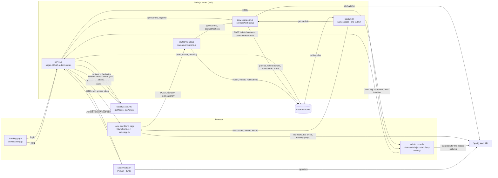

# Spotify Stats

A web app where my friends and I log in with Spotify to see our top genres, tracks and artists.

[](LICENSE)


**Live demo:** https://morotommaso.altervista.org/spotify-stats-demo-app/ (a static copy of the home page with a snapshot of my data: the real app only accepts the accounts I authorise on Spotify)

<!-- portfolio:summary
## The problem
I wanted to see my Spotify listening stats and my friends' stats in one place. I also wanted to learn how a third-party API with OAuth works in practice.

## The solution
A Node.js web app: you log in with Spotify and see your top genres, tracks and artists over three time ranges, plus your recent streams. You can add friends by Spotify ID and open their stats. An admin console shows who is online and the server errors.

## Technical challenges
- Keeping sessions alive: the server trades the Spotify refresh token for a new access token when the old one expires.
- Friends' stats: Spotify only shows top items to their owner, so the server stores each refresh token and uses it on the friend's page.
- Live updates: Firestore listeners push notifications, friend lists and the error log to the browser through Socket.IO.

## What I learned
- How the OAuth 2.0 authorization code flow and refresh tokens work.
- How to model friends, invites and notifications in Firestore.
- How to build an admin console with a live log of server errors.

## Stack
Node.js, Express, Socket.IO, Cloud Firestore, Spotify Web API, JavaScript, HTML, CSS, Python
-->

<!-- portfolio:start -->
## The problem
I built this for myself and my friends. Sites like [Spotify Stats](https://spotifystats.com/) show your top tracks and artists, and I wanted my own version with a social side: seeing what my friends listen to.

It was also an excuse to learn how a third-party API works beyond a single request: logging in with OAuth, keeping the session alive with refresh tokens, and calling the API both from the server and from the browser.

The Spotify app stays in development mode, so only the accounts I add by hand in the Spotify dashboard can log in. That's why only my friends and I used it.

## The solution
You open the site and log in with your Spotify account. The home page shows your profile picture, name, email and number of friends, then four sections:

- **Top genres:** Spotify doesn't give genres for a user, so I count how many of your top 50 artists have each genre and sort them.
- **Top tracks:** your 50 most played tracks. If you turn on the speaker button, hovering a cover for one second plays the 30-second preview with a fade in and fade out (Spotify no longer returns previews, see the limitations).
- **Top artists:** your 50 most played artists, with their popularity score.
- **Recent streams:** the last 30 tracks you played, grouped by day, with the time since you played them ("18 ore fa").

A selector switches the first three sections between the last 4 weeks, the last 6 months and all time. Clicking a cover or a name opens it on Spotify. The interface is in Italian.


Clicking your profile picture opens a side bar with your friends (and when they were last online), the invites you received (accept or decline) and the invites you sent (cancel). You add a friend by typing their Spotify ID. Every invite, answer or removal sends a notification to the other person, shown as a counter on the profile picture. Clicking a friend opens the same page with their stats.

At the bottom of the page you can download a Python script. It draws a bar chart of your 10 top genres of the last 4 weeks with `turtle`.

My account also has an admin console at `/admin`. It shows live how many people and devices are connected, how many accounts are registered, who went offline last, and the last 30 server errors. I can hide or delete an error, and open the stats of any user.


## Technical challenges
- **Keeping the session alive.** I followed Spotify's [authorization code flow](https://developer.spotify.com/documentation/web-api/tutorials/code-flow). An access token lasts one hour, so I keep it in an `httpOnly` cookie with the same lifetime and keep the refresh token in a longer one. When a Spotify call fails, the server deletes the access token and redirects to `/refresh_token`, which asks Spotify for a new one and sends the user back to the page they asked for (`?then=`). In the browser, a `401` from Spotify triggers the same redirect.
- **Showing a friend's stats.** Spotify only shows top tracks and artists to their owner, through that user's token. So at every login I save the user's refresh token in Firestore. When you open a friend's page, the server checks that you are friends and trades the friend's refresh token for a fresh access token. This works, but it has a security cost (see the limitations).
- **Friend system on a document database.** Each user document in Firestore has four subcollections: `friends`, `friend-invited`, `friend-invited-by` and `notifications`. An invite writes in two places, one for each user. Accepting it adds the friendship on both sides and deletes the invite. Before writing, the server checks the existing documents to block self-invites, duplicate invites and invites to people who already invited you.
- **Live updates without polling.** When the page opens a Socket.IO connection, the server reads the access token from the cookie, checks it with Spotify and starts Firestore [`onSnapshot` listeners](https://firebase.google.com/docs/firestore/query-data/listen) on the user's subcollections. Every change goes to the browser right away, and the listeners stop when the socket disconnects. The admin console uses its own namespace. The server keeps an in-memory list of connected users and devices and sends every change to it.

## What I learned
- How the OAuth 2.0 authorization code flow works: `state`, authorization code, access token, refresh token and how long each one lasts.
- How to use a third-party API from both the server and the browser, reading the official Spotify and Firebase documentation.
- How to model friends, invites and notifications in Firestore, writing the same relationship on both users.
- How to build an admin console: logging every server error to the database with status, path and user, and watching it live.

## Stack
- Node.js and Express
- Socket.IO for live updates
- Firebase Admin SDK with Cloud Firestore
- Spotify Web API
- `helmet`, `express-rate-limit`, `cookie-parser`, `dotenv`, `request-promise-native`
- HTML, CSS and JavaScript in the browser, without frameworks
- Python with `turtle` for the downloadable script
<!-- portfolio:end -->

## Architecture


The important choices:

- **Pages are JavaScript functions that return HTML.** Each file in `views/` takes the data and returns a template string. There is no template engine and no build step: the server is started with `node`.
- **Spotify data is loaded by the browser.** The server puts the access token in the page and `static/app.js` calls the Spotify Web API directly. The server only handles login, friends and notifications, and doesn't pass the large Spotify responses through. The cost is that the token is visible to the page's JavaScript.
- **Refresh tokens are saved in Firestore.** Without them the server couldn't show a friend's stats or let me open a user's stats from the admin console.
- **Errors go to the database.** `logError` saves status, error name, path and user in the `log` collection, and the admin console listens to it.
- **Basic protection on every request.** `helmet` sets a Content Security Policy, `express-rate-limit` allows 100 requests per minute per IP, and outside development mode every HTTP request is redirected to HTTPS and the cookies are `secure`.

## Running locally
You need:

- Node.js and npm. `package.json` declares Node 14; I checked that the server also starts on Node 22.
- A Spotify app from the [Spotify developer dashboard](https://developer.spotify.com/dashboard), with `http://localhost:3000/callback` as redirect URI. In development mode, add your account in the app's user management.
- A Firebase project with Cloud Firestore and a service account key (Project settings → Service accounts → Generate new private key).

```bash
git clone https://github.com/tommasomoro8/spotify-stats.git
cd spotify-stats
npm install
cp .env.example .env
```

Fill in `.env`:

| Variable | Value |
| --- | --- |
| `NODE_ENV` | `development` turns off the HTTPS redirect and the `secure` cookies |
| `URL` | The site address **with the final `/`**, e.g. `http://localhost:3000/`. Without it, `/` redirects to itself forever |
| `ADMIN_SPOTIFY_ID` | The Spotify user ID that can open `/admin` |
| `CLIENT_ID_SPOTIFY`, `CLIENT_SECRET_SPOTIFY` | From the Spotify dashboard |
| `REDIRECT_URI_SPOTIFY` | The same redirect URI set in the Spotify dashboard |
| `FIREBASE_SERVICE_ACCOUNT` | The whole service account JSON between single quotes. It can span several lines |
| `PORT` | Optional, defaults to `3000` |

Then start the server and open http://localhost:3000:

```bash
npm start
```

There are no automated tests. To see the interface without any setup, open [`docs/demo.html`](docs/demo.html) in a browser: it's the static demo, with the data saved inside the file.

## Repository structure
```
spotify-stats/
├── src/
│   ├── server.js          ← entry point: pages, OAuth, admin routes, Socket.IO
│   ├── routes/            ← friend invites and notifications (POST endpoints)
│   ├── services/          ← Spotify profile, Firestore helpers, random string for OAuth state
│   ├── middleware/        ← HTTPS redirect and trailing slash removal
│   ├── views/             ← pages as functions that return HTML (landing, home, admin, error)
│   ├── downloads/         ← template of the downloadable Python script
│   └── static/            ← browser JavaScript, CSS and icons
├── docs/
│   ├── demo.html          ← static demo with a snapshot of my data
│   └── screenshots/       ← images used in this README
├── .env.example           ← environment variables with placeholder values
├── package.json
├── README.md
├── LICENSE
└── portfolio.yml          ← metadata for my portfolio
```

## Known limitations and future work
Security problems I verified in the code:

- **A friend's token reaches your browser.** On `/<friend-id>` the server puts the friend's access token in the HTML. For one hour, whoever opens the page can call Spotify as that friend with all the app's scopes, including their email and listening history.
- **`/refresh_token` is open.** `/refresh_token?refresh_token=…&result=string` returns an access token for any refresh token, using the app's client secret. The Python script relies on it and contains the user's refresh token in plain text.
- **The OAuth `state` isn't checked.** `/login` generates it, but `/callback` only checks that it's present and never compares it, so the login has no CSRF protection.
- **Reflected XSS.** Values are put in the HTML without escaping, and the Content Security Policy allows inline event handlers. I ran the server with Spotify and Firestore replaced by stubs: on `/` the error page returns the tag as it is.
- **`SameSite` is never set.** The cookie option is written `SameSite` instead of `sameSite`, so Express ignores it. The refresh token cookie also lasts 10 years, not 1 year as the comment says.
- **The rate limit can be bypassed.** With `trust proxy` set to `true`, the client can choose its own IP with `X-Forwarded-For`. `express-rate-limit` prints the `ERR_ERL_PERMISSIVE_TRUST_PROXY` warning about it.

Other problems:

- If `URL` doesn't end with `/`, the home page redirects to itself forever.
- An address with a final slash and a query string (e.g. `/foo/?a=1`) returns a 500, because `middleware/removeLastSlash.js` uses `querystring` without importing it.
- `routes/friends.js` and `routes/notifications.js` call `logError` without importing it, so their error paths throw a `ReferenceError` instead of logging.
- Every page and every POST asks Spotify for the user's profile and writes it to Firestore. Every visit to a friend's page asks Spotify for a new access token for the friend.
- `server.js` is about 900 lines: pages, OAuth, admin routes and both Socket.IO namespaces in one file, with the same token check copied in every route.
- The list of online users lives in the server's memory. It resets at every restart and doesn't work with more than one instance.
- The audio preview no longer plays: in the data Spotify returned in October 2026, saved in `docs/demo.html`, `preview_url` is empty for all 130 tracks.
- Only accounts I add by hand in the Spotify dashboard can log in. There are no tests, and the interface is only in Italian.

What I would do next:

- **Split `server.js` by responsibility.** I would write one authentication middleware that checks the cookie, refreshes the token and sets `req.user`. Then pages, admin routes and socket handlers would go in separate files. This would remove the copied token checks and make each part testable on its own.
- **Keep friends' tokens on the server.** The server would call Spotify for the friend and send the browser only names, pictures and rankings. I would also save the access token with its expiry time and reuse it until it expires, instead of asking for a new one at every visit.
- **Encrypt refresh tokens in Firestore**, for example with AES-GCM and a key kept in an environment variable. A database leak alone would then not give access to people's Spotify accounts.
- **Fix the OAuth and cookie problems:** save `state` in a short-lived cookie at `/login` and compare it at `/callback`, write `sameSite`, and set `trust proxy` to the real number of proxies.
- **Escape every value in the views** and move the inline `onclick` handlers into the JavaScript files. Then the Content Security Policy could drop `'unsafe-inline'`.
- **Change the Python script** so it never contains a refresh token, using the PKCE flow that Spotify offers for apps that can't keep a secret.
- **Put the app in a Docker container** with a fixed Node version (`package.json` asks for Node 14, which is no longer supported) and use the Firestore emulator in `docker compose`, so anyone can run the project without a real Firebase project.

## Credits and license
- I designed and built the whole project on my own.
- Inspired by [Spotify Stats](https://spotifystats.com/).
- I followed the official documentation: [Spotify Web API](https://developer.spotify.com/documentation/web-api) with its [authorization code flow](https://developer.spotify.com/documentation/web-api/tutorials/code-flow), [Firebase Admin SDK](https://firebase.google.com/docs/admin/setup) and [Cloud Firestore](https://firebase.google.com/docs/firestore).

The code is released under the [MIT License](LICENSE).

---

Created by Tommaso Moro in May 2023.
